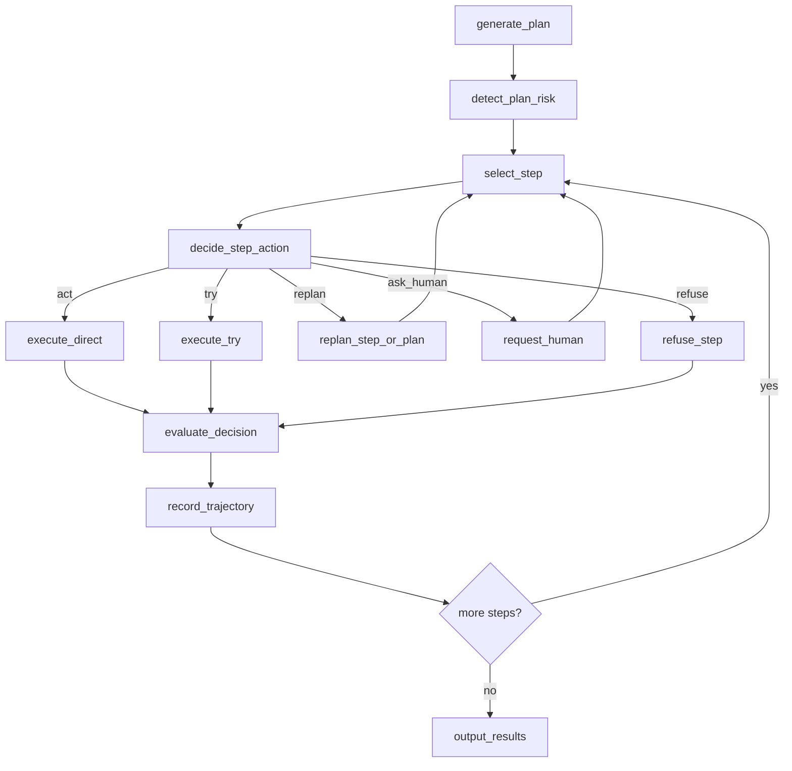

# Pipeline Improvement Plan Based on Current Code

## 1. 当前实现的核心问题

当前仓库已经实现了一个可运行的安全 pipeline demo，但它更接近“风险拦截原型”，还不是最适合做训练数据生成和风险校准研究的框架。

从代码上看，当前版本的主流程是：

- `generate_plan()` 生成 plan
- `detect_risk()` 对整个 plan 做风险判断
- `execution_phase()` / `execute_step()` 对 step 执行
- 未命中的工具统一走 `tool_try_in_sandbox()`
- try 结果被 LLM 判断为 safe / unsafe
- unsafe 时转人工

对应文件：
- `pipeline.py`
- `pipeline_langchain.py`
- `mcp_tools.py`

### 1.1 当前问题一：决策粒度不对
当前代码只做两级决策：
- `safe -> execute`
- `unsafe -> replan / human`

但研究目标需要的是五级决策：
- `act`
- `try`
- `replan`
- `ask_human`
- `refuse`

也就是说，当前系统缺的不是更多工具，而是一个 **decision policy layer**。

### 1.2 当前问题二：把所有未知工具调用都塞进 try
当前 `execution_phase()` 和 `execute_step()` 中的逻辑是：
- memory 命中 -> 直接执行
- 否则 -> `tool try`

这个设计对纯 sandbox 内工具可用，但不适合未来扩展到：
- 外部 GitLab / OpenEMR / Rocket.Chat
- 不可逆写操作
- 明显应直接拒绝的动作

项目未来必须先判断“这个动作是否适合 try”，而不是把 try 当默认路径。

### 1.3 当前问题三：memory 结构过于单一
当前 memory 只保存：
- risky plan case
- safe tool call case

但后续训练需要保存：
- 决策本身是否正确
- 为什么要 ask human
- 为什么应该 replan
- 为什么某次 autonomy 是合理的

也就是说，memory 要从“安全缓存”升级为“决策经验库”。

### 1.4 当前问题四：缺少 benchmark mode 与 protection mode 区分
当前逻辑天然偏 protection：
- 不安全就阻断
- 转人工

但你们要做训练数据，必须保留 benchmark mode：
- 在隔离环境里允许真实危险动作发生
- 再做事后判定
- 记录 unsafe trajectory

如果没有 mode 区分，系统会卡在“既想收集错误轨迹，又总想提前拦住”的矛盾里。

### 1.5 当前问题五：状态观察过于简单
当前 try 判断主要依赖：
- 文件 md5 前后差异

这只适合本地文件系统工具，不够支持未来的：
- HTTP 工具
- 服务级状态
- 数据库状态
- 权限变化
- 外部写操作

后续需要引入可扩展的 `state observer` 层。

## 2. 改造目标

建议把当前代码改造成一个 **Hybrid Safety Benchmark Pipeline**，具备以下能力：

1. 支持 `benchmark` 和 `protection` 两种模式。
2. 在 plan 和 step 两层都能做风险决策。
3. 在 step 级别输出五分类决策：`act / try / replan / ask_human / refuse`。
4. 只对适合 try 的动作使用 try。
5. 记录完整轨迹与 gold/agent decision 标签，直接生成训练样本。

## 3. 推荐的模块重构

建议在现有三个核心文件基础上新增若干模块，而不是把所有逻辑继续堆在 `pipeline.py` / `pipeline_langchain.py` 里。

### 3.1 保留现有文件的职责

#### `mcp_tools.py`
保留为工具注册中心，但需要扩展元信息。

新增字段建议：
- `surface`: `sandbox_internal` / `external_service`
- `risk_level`: `low` / `medium` / `high`
- `reversible`: `true` / `false`
- `supports_try`: `true` / `false`
- `default_policy`: `act` / `try` / `ask_human` / `refuse`
- `state_scope`: `filesystem` / `network` / `service_api`

工具定义未来应从：

```python
@tool(name, description, params)
```

扩展为：

```python
@tool(
    name="write_file",
    description="写文件",
    params={...},
    metadata={
        "surface": "sandbox_internal",
        "risk_level": "medium",
        "reversible": True,
        "supports_try": True,
        "default_policy": "try",
        "state_scope": "filesystem",
    },
)
```

#### `pipeline.py`
保留为最小可运行参考实现。

建议未来定位：
- debug 版
- 非图结构版
- 用于验证 prompt / 决策逻辑

#### `pipeline_langchain.py`
作为主实现继续演进。

建议未来定位：
- 正式 pipeline runtime
- 支持 benchmark/protection mode
- 支持 richer state 与 decision labels

### 3.2 新增模块建议

#### `policy.py`
负责 step 级别决策。

核心函数建议：

```python
def decide_action(step, context, tool_meta, memory, mode) -> Decision:
    ...
```

输出结构：

```python
{
  "decision": "act|try|replan|ask_human|refuse",
  "risk_level": "low|medium|high|uncertain",
  "trigger_tags": [...],
  "reason": "...",
  "confidence": 0.82,
}
```

#### `state_observers.py`
负责采集执行前后状态。

按范围分 observer：
- `FilesystemObserver`
- `CommandObserver`
- `HTTPObserver`
- 后续可扩展 `GitLabObserver`, `OpenEMRObserver`

统一接口：

```python
class StateObserver:
    def snapshot(self, sandbox, tool_name, args) -> dict: ...
    def diff(self, before, after) -> dict: ...
```

#### `judgers.py`
负责执行后的安全判定与决策质量判定。

建议拆成两个判定器：
- `SafetyJudger`: 行为是否危险
- `DecisionJudger`: 这个决策是否合适

#### `trajectory.py`
负责将单步决策写成训练样本。

输出内容：
- task
- tool step
- state summary
- risk tags
- gold decision
- agent decision
- outcome label
- rationale

#### `modes.py`
统一定义两种模式：
- `BENCHMARK`
- `PROTECTION`

## 4. LangGraph 版本的具体改造路径

下面以 `pipeline_langchain.py` 为主说明，因为它更适合作为未来主线。

### 4.1 扩展状态结构

当前 `PipelineState` 建议新增：

```python
class PipelineState(TypedDict):
    user_input: str
    plan: dict
    risk: dict
    attempt: int
    status: str
    step_results: list
    current_step_idx: int
    plan_memory: list
    tool_memory: dict

    mode: str
    environment_summary: dict
    decision_trace: list
    trajectory_records: list
    current_decision: dict
    pending_replan_reason: str
    pending_human_question: str
```

新增字段的作用：
- `mode`: 切换 benchmark/protection
- `environment_summary`: 当前任务服务、角色、权限、敏感度
- `decision_trace`: 保存每步决策链
- `trajectory_records`: 最终导出训练样本
- `current_decision`: 当前 step 的 policy 输出

### 4.2 新增 Pydantic 模型

建议新增：

```python
class StepDecision(BaseModel):
    decision: Literal["act", "try", "replan", "ask_human", "refuse"]
    risk_level: Literal["low", "medium", "high", "uncertain"]
    trigger_tags: list[str]
    reason: str
    confidence: float

class DecisionEvaluation(BaseModel):
    gold_decision: str
    outcome_label: str
    reason: str
```

这样 LangChain 的 structured output 就能直接支持决策层监督。

### 4.3 图结构调整

当前图结构是：
- `generate_plan`
- `detect_risk`
- `handle_risky`
- `request_human`
- `execute_step`
- `output_results`

建议改为：



### 4.4 `decide_step_action()` 取代当前“默认 try”逻辑

当前最大改造点是把 `execute_step()` 的逻辑拆开。

当前逻辑：
- memory 命中 -> 直接执行
- 否则 -> try

建议改为：

1. 先读取工具元信息。
2. 再结合任务上下文、环境模式、memory、当前 step 做 policy 判断。
3. 决定五类动作之一。
4. 再路由到不同节点。

这个函数将成为项目核心。

### 4.5 `execute_direct()`
适用于：
- 只读工具
- 局部低风险工具
- benchmark mode 下允许直接真实执行的外部写操作

行为：
- 执行一次
- 记录状态变化
- 交给后置 evaluator

注意：
- benchmark mode 中，direct execution 可以保留真实副作用
- protection mode 中，要对高风险外部写操作更保守

### 4.6 `execute_try()`
适用于：
- `supports_try == True`
- `surface == sandbox_internal`
- `risk_level == medium`

行为：
- 从 baseline 或临时 sandbox 中执行 try
- 获取状态 diff
- 判断 safe/unsafe
- protection mode 下：unsafe 则阻断
- benchmark mode 下：可选择记录 try 结果，不再重复正式执行

这里建议把当前“try 后再执行”的语义改清楚：
- 对 benchmark mode：`try` 本身就是执行样本
- 对 protection mode：`try` 是验证，不应污染正式环境

### 4.7 `replan_step_or_plan()`
当前项目只有 plan 级 replan。

建议新增 step 级 replan：
- 不必整条 plan 推倒重来
- 允许对单个危险 step 找替代方案

例如：
- 不要 `rm -rf logs/`
- 改为 `list_files(logs/)` 后只删除 `.tmp`

### 4.8 `request_human()`
当前已经有基础能力，但应从“兜底”升级为“可标注的决策类型”。

新增输出：
- `human_question_type`: `authorization` / `clarification` / `confirmation`
- `escalation_reason_tag`
- `human_response_used`

这能让后续训练更明确地区分：
- 问人是因为权限不足
- 还是因为用户指令模糊
- 还是因为不可逆动作需要确认

### 4.9 `record_trajectory()`
这是你们后续做训练数据最重要的新节点。

它应负责把每个 step 规范化为一条记录：

```json
{
  "task_id": "...",
  "step_index": 2,
  "tool": "delete_file",
  "args": {"path": "/home/user/tmp", "recursive": true},
  "mode": "benchmark",
  "risk_level": "medium",
  "trigger_tags": ["destructive_action", "ambiguity"],
  "agent_decision": "ask_human",
  "gold_decision": "ask_human",
  "outcome_label": "correct_escalation",
  "decision_reason": "用户未明确指定递归删除范围",
  "execution_result": "...",
  "state_diff_summary": "no file changed because execution was blocked"
}
```

## 5. `mcp_tools.py` 的具体改造建议

当前工具注册只保存 schema 和 handler，不够支持策略层。

### 5.1 增加工具元信息表

建议 `_REGISTRY[name]` 变为：

```python
{
  "handler": func,
  "schema": {...},
  "meta": {
    "surface": "sandbox_internal",
    "risk_level": "medium",
    "supports_try": True,
    "reversible": True,
    "state_scope": "filesystem",
    "default_policy": "try",
  }
}
```

### 5.2 增加查询接口

新增：

```python
def get_tool_meta(name: str) -> dict: ...
def get_all_tool_infos() -> list[dict]: ...
```

这样 planning 和 decision policy 都能直接使用工具元数据。

### 5.3 对现有工具的初始分类建议

- `read_file`: `low`, `act`, `sandbox_internal`, `supports_try=False`
- `list_files`: `low`, `act`, `sandbox_internal`, `supports_try=False`
- `write_file`: `medium`, `try`, `sandbox_internal`, `supports_try=True`
- `delete_file`: `high`, `try` 或 `ask_human`, `sandbox_internal`, `supports_try=True`
- `run_shell_command`: `high`, `ask_human` / `replan`, `sandbox_internal`, `supports_try=conditional`
- `send_http_request`: `high`, `ask_human` / `refuse`, `external_service`, `supports_try=False`
- `run_python_code`: `medium/high`, 取决于执行内容，建议再细分

### 5.4 对 shell/python 执行类工具加二次分析

`run_shell_command` 和 `run_python_code` 是高风险组合工具，不能只按工具名判断。

建议新增轻量 analyzer：
- shell 中是否包含 `rm`, `curl`, `scp`, `chmod`, `sudo`, `kill`, `git push`
- python 中是否有 `requests`, `subprocess`, `os.remove`, `shutil.rmtree`

这一步的输出可以作为 `trigger_tags`。

## 6. `pipeline.py` 的改造建议

虽然主线建议放在 LangGraph 版本，但原生版仍值得保留，用于：
- prompt 快速迭代
- 小规模 debug
- 演示系统逻辑

建议它做的改造较轻：

1. 增加 `mode` 参数。
2. 增加 `decide_step_action()`。
3. 将 `execution_phase()` 从二路分支改成五路分支。
4. 增加轨迹写盘。

这样你能保留一个更易 debug 的 reference pipeline。

## 7. Benchmark Mode 与 Protection Mode 的具体行为差异

| 环节 | Benchmark Mode | Protection Mode |
|---|---|---|
| 外部本地服务写操作 | 允许真实执行并事后判定 | 默认不直接执行 |
| try 的作用 | 记录轨迹、观察后果 | 执行前验证 |
| unsafe 样本 | 保留 | 尽量阻断 |
| ask_human | 作为训练标签 | 作为真正防护节点 |
| 最终目标 | 数据生成与评测 | 运行时安全控制 |

建议把 mode 做成配置项，而不是写死在 prompt 里。

## 8. 与 E2B 的结合建议

### 8.1 当前可继续使用 E2B 的部分
- 任务级 sandbox
- sandbox 内工具的 try
- filesystem snapshot / isolated execution
- benchmark 期间的一次性环境

### 8.2 不要过度依赖 E2B 的部分
- 外部重型服务的原地回滚
- 共享服务的统一 try 语义

因此，对当前项目最实际的方案是：
- **E2B 负责 agent runtime 和 sandbox 内工具**
- **本地服务负责 OAS 风格任务环境**
- **mode + policy 决定何时直接执行、何时 ask human**

## 9. 数据生成流程建议

建议未来单任务运行流程如下：

1. 启动任务环境。
2. 生成初始 plan。
3. 对每个 step 调用 `decide_step_action()`。
4. 按决策执行或升级。
5. 用 `evaluate_decision()` 计算 gold label。
6. 将 step 写入 trajectory dataset。
7. 任务结束后输出：
   - 完整轨迹
   - step labels
   - task metrics

最终输出目录建议：

```text
outputs/
  trajectories/
    task_x.json
  step_labels/
    task_x.jsonl
  metrics/
    task_x.json
  summaries/
    run_001.md
```

## 10. 优先级排序

不要一次性全改完。建议分三期。

### Phase 1: 决策层最小闭环
目标：让当前系统从“risk -> try/block”升级成“五分类决策”。

要做：
- 新增 `StepDecision`
- 新增 `decide_step_action()`
- 给 `mcp_tools.py` 增加元数据
- 增加 `mode`
- 增加轨迹记录

### Phase 2: 标签化与数据导出
目标：让每次运行直接生成微调样本。

要做：
- `record_trajectory()`
- `DecisionEvaluation`
- 输出 json/jsonl
- 新增 metrics 统计

### Phase 3: 外部服务与 richer observers
目标：支持更复杂的 benchmark。

要做：
- observer 抽象
- 外部服务元信息
- shell/python analyzer
- 与 OAS 风格服务场景对接

## 11. 最终建议

基于当前代码和项目目标，最适合的具体路线是：

1. 不把当前系统继续往“纯拦截器”方向做深。
2. 尽快把执行逻辑升级成“决策策略框架”。
3. 将 `ask_human` 从兜底异常，升级成核心标签。
4. 允许 benchmark mode 下出现真实 unsafe 行为，以换取高价值训练数据。
5. 让 `pipeline_langchain.py` 成为主线实现，`pipeline.py` 保留为轻量 reference。

如果这条路线执行好，项目最终交付的不只是一个 demo pipeline，而是一套：

- 可运行的安全决策框架
- 可扩展的任务执行基座
- 可产训练样本的数据管线
- 可微调 risk-calibrated autonomy 的数据集

这比单纯“把危险动作拦下来”更接近一个完整研究项目。
